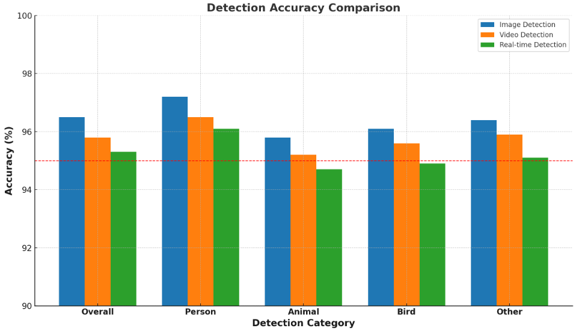

# YOLO-object-detection-with-OpenCV

A comprehensive implementation of real-time object detection using the YOLO (You Only Look Once) architecture. This system can detect objects from images, videos, and real-time camera feeds with high accuracy and performance.


## Features

- **Multiple Detection Modes**
  - Image-based detection
  - Video file detection
  - Real-time camera detection

- **Intelligent Classification**
  - Person detection
  - Animal detection
  - Bird detection
  - Other objects detection

- **Performance Optimization**
  - Non-maximum suppression to eliminate overlapping bounding boxes
  - Configurable confidence thresholds
  - Frame resizing for optimal performance

- **Rich Visualization**
  - Color-coded object categories
  - Confidence percentages
  - FPS counter
  - Real-time accuracy metrics

## System Requirements

- Python 3.6+
- OpenCV 4.x
- NumPy
- imutils
- matplotlib (for charts and visualization)

## Project Structure

```
SmartSentry/
├── yolo-coco/                   # YOLO model files
│   ├── coco.names               # Class names
│   ├── coco.names.original      # Original COCO class names
│   ├── yolov3.weights           # Pre-trained weights
│   ├── yolov3.cfg               # Network configuration
│   └── yolov3-custom.cfg        # Custom configuration
│
├── Object dection using image/  # Image detection module
│   ├── images/                  # Sample images
│   └── yolo.py                  # Image detection implementation
│
├── Object detection using video/ # Video detection module
│   ├── videos/                  # Sample videos
│   ├── output/                  # Output directory
│   └── yolo_video.py            # Video detection implementation
│
├── real-time-object-detection/  # Real-time detection module
│   ├── real_time_object_detection.py  # Real-time implementation
│   └── MobileNetSSD files       # Alternative model files
│
├── charts/                      # Charts and visualizations
│   └── images/                  # Generated charts
│
├── accuracy_comparison.py       # Accuracy comparison visualization
└── system_workflow.py           # System workflow visualization
```

## Installation

1. Clone this repository:
   ```
   git clone https://github.com/yourusername/SmartSentry.git
   ```

2. Download the YOLOv3 weights (if not included):
   ```
   cd SmartSentry
   # From official YOLO website
   wget https://pjreddie.com/media/files/yolov3.weights -P yolo-coco/
   ```

3. Install dependencies:
   ```
   pip install opencv-python numpy imutils matplotlib
   ```

## Usage

### Object Detection in Images

```bash
cd "Object dection using image"
python yolo.py --image images/example.jpg --yolo ../yolo-coco
```

### Object Detection in Videos

```bash
cd "Object detection using video"
python yolo_video.py --input videos/example.mp4 --output output/result.avi --yolo ../yolo-coco
```

### Real-time Object Detection

```bash
cd real-time-object-detection
python real_time_object_detection.py --confidence 0.6 --threshold 0.3
```

## Performance

The system achieves high accuracy across different detection scenarios:



- **Image Detection**: ~96.5% overall accuracy
- **Video Detection**: ~95.8% overall accuracy
- **Real-time Detection**: ~95.3% overall accuracy

## Customization

You can customize the detection parameters:

- **--confidence**: Minimum probability threshold (default: 0.6)
- **--threshold**: NMS threshold for eliminating overlapping boxes (default: 0.3)

## Applications

- Security surveillance
- Wildlife monitoring
- Pedestrian detection
- Object counting and tracking
- Intruder detection systems

## License

This project is released under the MIT License.

## Acknowledgments

- YOLOv3 by Joseph Redmon and Ali Farhadi
- COCO dataset for pre-trained weights
- OpenCV team for the excellent computer vision library 
